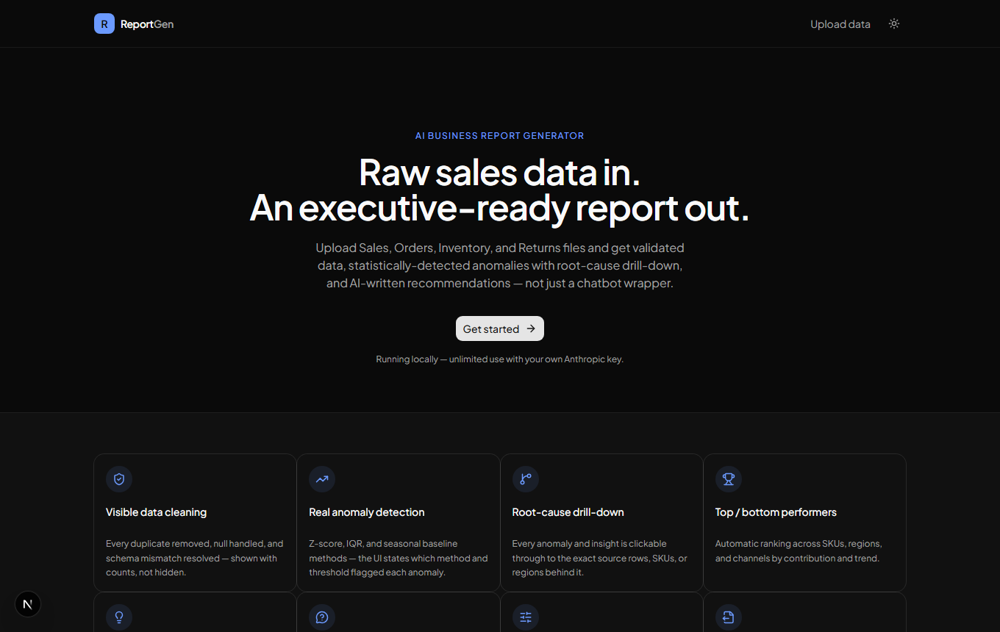
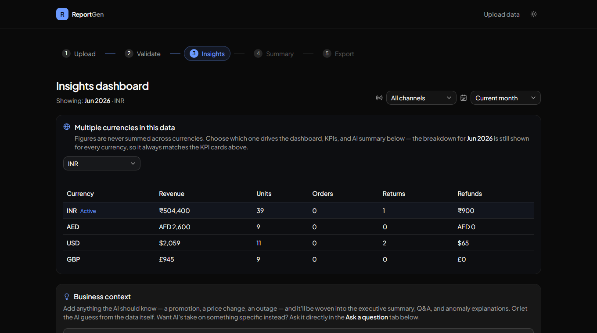
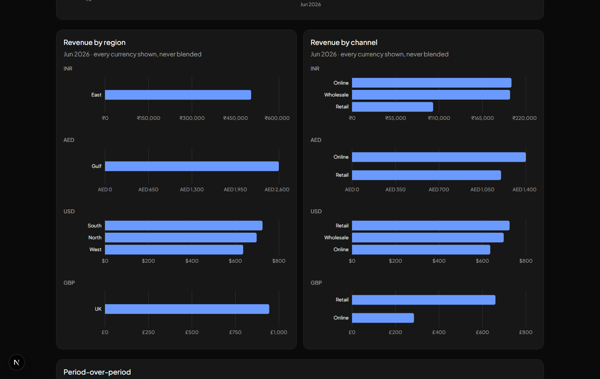
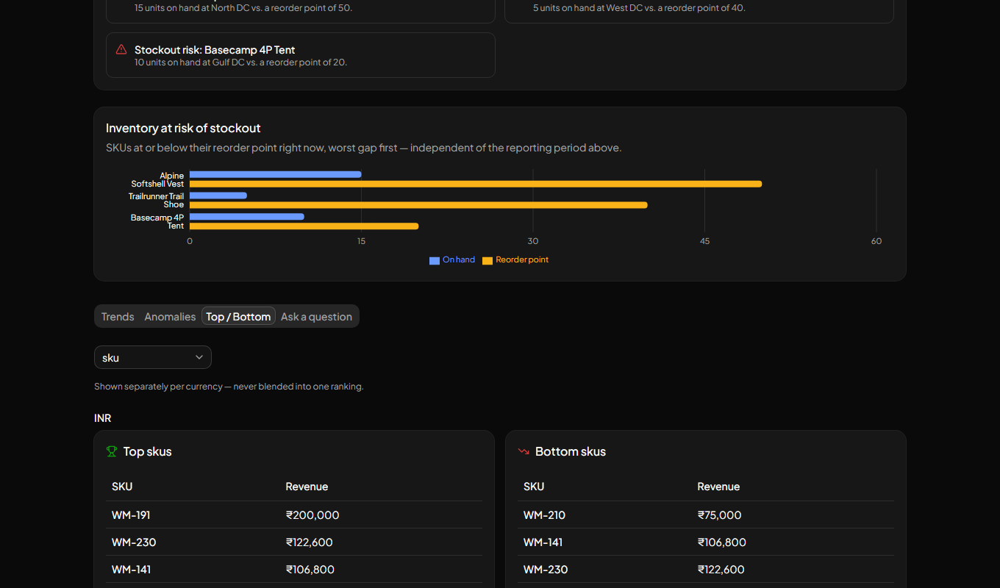

# ReportGen — AI Business Report Generator

Turn raw Sales, Orders, Inventory, and Returns exports into an executive-ready
report: validated data, statistically-detected anomalies with root-cause
drill-down, top/bottom performer rankings, risk/opportunity flags, an
AI-written executive summary with free-form Q&A, and PDF/Excel export —
built to feel like a premium internal tool, not a chatbot wrapper.

**[Live demo →](https://reportgen-sooty.vercel.app/)** (one free AI-powered analysis per visitor)



## Why it's more than an LLM wrapper

Multi-currency and multi-channel data is where most "AI report" tools quietly
get the numbers wrong — summing $100 and ₹100 into one number, or letting a
channel filter accidentally collapse a chart down to one category. This app
is built around never doing that:

- **Currencies are never blended.** If a file mixes USD and INR, every KPI,
  chart, and AI-generated line is scoped to one currency at a time — the
  breakdown table for every other currency is still shown, so it's always
  possible to check the total against the parts.
- **Every chart stays independent of the active filter it doesn't need.**
  "Revenue by region/channel" shows every currency's own breakdown side by
  side, rather than silently shrinking to whatever the currency selector
  happens to be set to.
- **Blanks explain themselves.** Hover any "—" or "N/A" — margin, return
  rate, period-over-period — and it says exactly why (no Unit Cost column
  mapped, no prior-period data, Returns has no channel field, etc.) instead
  of leaving you to guess.



## Features

- **Visible data cleaning** — duplicates removed, nulls handled, schema
  mismatches resolved, shown with counts, not hidden
- **Smart column mapping** — auto-matches file headers to the expected
  schema (exact → fuzzy → similarity), with a manual review step for
  anything it isn't confident about
- **Real anomaly detection** — z-score, IQR, and rolling-baseline methods,
  with the method and threshold stated next to every flagged anomaly
- **Root-cause drill-down** — every anomaly and insight clicks through to
  the exact source rows behind it
- **Currency segmentation** — automatic detection of mixed currencies, a
  selector to choose which one drives the dashboard, and a full per-currency
  breakdown so nothing is ever silently summed across currencies
- **Channel & date-range filtering** — narrow the whole report to one sales
  channel or an arbitrary date range, with an equivalent-length
  prior-period comparison when a custom range is active
- **Top/bottom performers** — ranked by SKU, region, or channel, shown
  per-currency when the data has more than one
- **Inventory risk chart** — on-hand vs. reorder point for every SKU at risk
  of stockout
- **AI executive summary** — a scannable, bulleted management summary
  generated from the exact KPIs/anomalies/performers on screen
- **Natural-language Q&A** — ask what happened this period, why a KPI
  moved, or what to do next, with one-click suggested prompts
- **Business context notes** — tell the AI about a promotion, price change,
  or outage (or let it guess from the data), and it's woven into every
  AI-generated explanation
- **Boardroom-ready export** — PDF and Excel, styled as a management report
  rather than a raw data dump




## Tech stack

- **Framework:** [Next.js](https://nextjs.org) (App Router, TypeScript)
- **Styling/UI:** [Tailwind CSS](https://tailwindcss.com) + [shadcn/ui](https://ui.shadcn.com) (Base UI primitives)
- **Charts:** [Recharts](https://recharts.org)
- **Data parsing:** [Papaparse](https://www.papaparse.com) (CSV), [SheetJS](https://sheetjs.com) (Excel)
- **State:** [Zustand](https://zustand-demo.pmnd.rs)
- **AI:** [Anthropic](https://www.anthropic.com) (local dev) and [Groq](https://groq.com) (production), behind one internal provider interface so switching never touches business logic
- **Rate limiting:** [Vercel KV](https://vercel.com/docs/storage/vercel-kv) (Upstash Redis)
- **PDF export:** [@react-pdf/renderer](https://react-pdf.org)
- **Deployment:** [Vercel](https://vercel.com)

All file processing happens client-side — nothing is stored server-side.

## Local development

```bash
npm install
cp .env.example .env.local
# edit .env.local: AI_PROVIDER=anthropic, ANTHROPIC_API_KEY=sk-ant-...
npm run dev
```

Open [http://localhost:3000](http://localhost:3000). Locally, the app runs
unlimited against your own Anthropic key — no rate limiting, no "demo" copy.

## Deploying your own copy

1. Import the repo into [Vercel](https://vercel.com/new)
2. Set environment variables in the project settings:
   - `AI_PROVIDER=groq`
   - `GROQ_API_KEY=` your Groq key
3. *(Optional)* Add a Redis database from the **Storage** tab and connect it
   to the project — this auto-injects `KV_REST_API_URL` /
   `KV_REST_API_TOKEN`, which enables the real "one free analysis per
   visitor" limit. Without it, the app fails open (unlimited) rather than
   breaking.
4. Redeploy

See `.env.example` for the full list of variables.

---

Built as a portfolio project — not affiliated with any employer.
